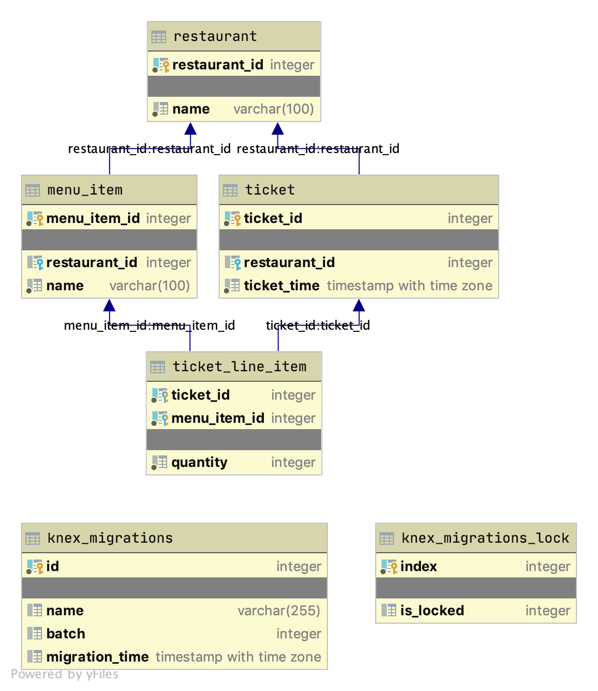

# Snackpass Take-Home Project

Author: Max Herzig (work@maxherzig.com)

This is my attempt at the take-home project, a page that loads trending menu items from an API. It consists of three containers--one for postgres, one that runs the API, and one that serves the front end SPA.

Did this all happen in around two hours? No way! My reasoning: while I tried to stick to that 2-3 hour timeframe for the _functional code_, given that the role involves working with others to architect and design solutions, I figured it was worth spending a bit of additional time creating other artifacts that show how that process might work. Also, I have a bootstrap project that I generally start from so there is a bunch of boilerplate code in there already, but I wouldn't count that against the timeframe as I suspect you already have project templates or boilerplate that you use to get your own projects started quickly.

## Running the project

### Prerequisites
- Docker
- Node v12 running locally (or `nvm use 12` from the project root)

### Steps

1. Clone the repo at https://github.com/mherzig/snackpass-project.
1. In the project, in both the `frontend` and `backend` directories, run `npm i`.
1. Back in the project root, run `docker-compose -f trending.yaml up` (this might take a while if you don't have the needed images cached on your machine).
1. Once all of the containers are running, you need to reset the tickets for the last week. You can do that by running `curl -XPOST http://localhost:3000/v1/reset`.
1. Now you can run the front end! In your browser to go http://localhost.
1. If you want to try it on a phone or tablet, find your computer's IP address and make sure your device is on the same wifi network. If your computer's IP is 192.168.1.5, for example, in your device's browser go to http://192.168.1.5.
1. If you've been away for a while or any time you want to refresh the orders, run `curl -XPOST http://localhost:3000/v1/reset` again. This will clear out any tickets and set up all new ones for the past week.

## API documentation

The OpenAPI (Swagger) spec can be found at https://app.swaggerhub.com/apis/mherzig/sp-proj/1.0.0. In case that link doesn't work for some reason, the YAML is also in the project root as `openapi.yaml`. You can pretty much ignore the `POST /reset` endpoint as it's only there to help seed sample data into the system, nothing that you would want to see in production.

The other endpoints though do serve a purpose, and if this API was hosted on a server somewhere you could use the panels on the right to test the API.

## Schema ERD

The ERD for the database is shown below:

It's very simple, of course there would be much more needed for a full application, but it gets the job done.

## Back end

The trending heuristic I used was pretty simple--average hourly purchases of an item over the past 48 hours divided by the average hourly purchases of the same item over the past week. Values above `1` mean that the average is higher over the last 48 hours, values below `1` mean the average is lower. This also eliminates anything not purchased over the last 2 days, as the numerator would be 0. Any value above `1` is considered trending for the purposes of this project, and the items are send in descending order, so "most trending" is at the top. This typically leaves around 270 items as "trending."

When the front end hits `GET /trending` for the first time it won't send `cursor` or `offset` params. This  causes the back end to first calculate the order of the trending menu items and send the IDs to the back end. There, they are cached. In this project they are cached in memory, but typically we would cache in an external cache (Redis, NoSQL, even possibly the DB itself). The back end makes another call to the database with the first 20 item IDs and gets the extended information and returns those plus a path to call for the next page with `cursor` and `offset` already set.

On subsequent calls to `GET /trending` where `cursor` and `offset` _are_ set, the endpoint will look up the IDs for that cursor in the cache, get the next page starting from the offset, and query the DB for the item info. Once again the next page path is set and it all goes back to the front end. Eventually there will be no more items and in that case the `nextPage` key won't be send back.

Why cache it? Two main reasons:

1. For something like this, trending items could change at any moment. If we always go to the DB for the items and then grab the offset from there, an item may have moved around and we could have one that was #20 in the first call and then dropped to #21 in the second call, and it would now appear twice. We could do more work in the front end to make sure we don't have dupes, but I'd rather make the back end do as much of the heavy lifting as possible and keep the front end clean.
1. While this calculation to find the trending items is quick (about 120ms on my machine), that doesn't mean that is always the case. A more complex algorithm against millions of rows might take a few seconds, and we don't want that cost every time someone opens the trending list. If this was the case we might have a separate job that finds trending items every five minutes or so and saves the list of item IDs somewhere along with the latest key. In that case, the first call to `GET /trending` would go get the latest key and look up the latest list, and that key would be maintained so even if a new trending calc happened, the list is still stable for those who are already on the page.

## Front end

Pretty basic, uses React with Redux as the store and Redux Saga to set up the actual API calls. The only thing that may not be straightforward is the use of `takeLeading`. The user might have scrolled to the bottom of the list and it could be trying to fire hundreds of events to get the next group, but `takeLeading` ensures only the first call happens, the rest get cancelled before they even start.

The component that does the heavy lifting is a virtualized list container. I wanted to go with a virtualized container becuase if there is technically no end to the number of items we might have, this helps by only rendering the ones that are visible. If an item goes offscreen it gets removed so the app isn't maintaining any part of that in the DOM.

One bug I found with it is that if you change the browser size it can sometimes get into a state where it shudders. It's probably an issue with the component that calculates the available space for the list component. If I were to spend more time on this project I would look into that further, as it might mean fixing a bug and submitting a PR to the project maintainer or building a similar component from scratch.

For a project this size there are too many components that do nothing but contain a child component. It's set up this way as it would make more sense with a larger project even if it's a bit abstract for this one at it's current scope.

The visual design is also pretty basic since I'm not a designer, but I've certainly put together some more complex designs if one is handed to me.

## Testing

If you go into the `backend` folder you can run unit tests with `npm run test`. I added a couple because it's important to show. Much more could be added. Especially for the front end, which could make use of component snapshots or even setting up [Storybook](https://storybook.js.org/).